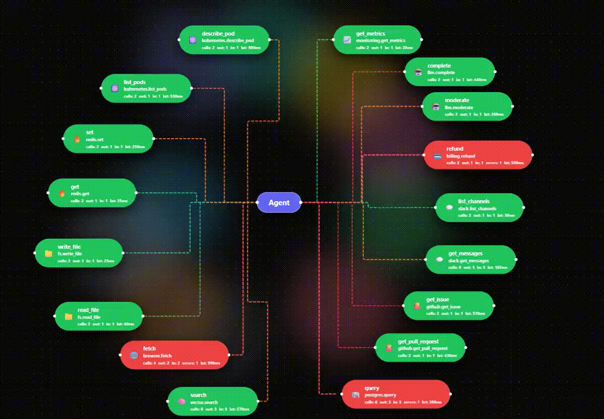

# Sentinel - The MCP Interceptor  


> **A drop-in, zero-config, unstoppable tap into Model Context Protocol traffic.**  
> Watch your LLM agent *think*, *reach out to tools*, and *react to errors* - all rendered as a glowing, real-time, force-directed neural map.

Sentinel acts like a **transparent, fail-open sidecar** that sits between your LLM client and its MCP tools. It doesn’t change the traffic. It doesn’t interfere. It simply *sees everything*, interprets it, and broadcasts a structured event stream to a front-end visualization that feels more like a sci-fi UI than a dev tool.

Whether you're building agents, debugging tool behavior, stress-testing long chains, or injecting observability into a black-box LLM workflow—**Sentinel makes the invisible visible.**

---

## 🔍 Sentinel vs Official MCP Inspector

| Feature     | Official MCP Inspector                        | Your Interceptor (Sentinel)                                 |
|-------------|------------------------------------------------|--------------------------------------------------------------|
| **Use Case** | Testing a single tool in isolation.            | Monitoring a **live Agent** (Claude/Cursor) using tools.     |
| **Integration** | Runs as a separate web app.                   | Runs transparently **inside your IDE / workflow**.           |
| **Visuals** | Static lists of resources/prompts.              | **Live Force-Directed Graph** of agent–tool architecture.     |
| **Security** | None (purely for debugging).                    | **Active Blocking** & **PII Redaction**.                     |


# 🚀 Why Sentinel Exists

LLM agents call tools. Tools call back. Debugging that flow often feels like working blindfolded.

Sentinel removes the blindfold.

You’ll get:

- Every MCP request in real-time  
- Every response, including failures  
- Latency by method  
- Request → response correlation  
- Fully redacted sensitive fields  
- A gorgeous visualization that instantly shows what your agent is doing  

It’s like Chrome DevTools…  
…but for MCP agents.

---

# ✨ Core Features

### **📡 Transparent MCP Sidecar**
Drop Sentinel in front of any MCP server and instantly get deep visibility - no code changes, no rewrites, no patching.

### **⚡ Zero-Copy, Sub-Millisecond Proxying**
Sentinel intercepts JSON-RPC traffic without buffering or mangling payloads. True pass-through with <1ms overhead.

### **🧠 Real-Time Interactive Graph**
Every tool call becomes a glowing edge.  
Every response updates the node’s stats.  
Errors pulse red.  
High-latency calls glow warm.  
Your agent’s “thought graph” becomes alive.

### **🔐 Built-in PII Redaction**
API keys, tokens, emails, secrets - scrubbed *before* forwarding anything to the visualization layer.

### **💥 Fail-Open Guarantee**
If the UI crashes or the WebSocket drops:  
**your MCP pipeline continues unfazed.**  
Sentinel refuses to break your agent.

### **🖥️ Claude Desktop Ready**
One command patches Claude Desktop to route MCP requests through Sentinel while preserving backups.

---

# 🏗 Architecture

**Pattern:** Transparent Sidecar (T-Tap)  
**Philosophy:** Fail Open  
**Tech Stack:** Rust (Tokio) • TypeScript • React • React Flow • WebSockets  

---

# 💎 Full Feature List

- Zero-copy pass-through of stdin/stdout MCP traffic  
- Event bus via WebSocket for live dashboards  
- Full JSON-RPC parsing (requests, responses, errors)  
- Request correlation via session tracking  
- Per-method statistics:  
  - Call count  
  - Success count  
  - Error count  
  - Inbound/outbound ratio  
  - Latency  
- Beautiful plasma-graded background  
- Animated edges:  
  - Green = success  
  - Yellow = pending  
  - Red = failure  
- Clickable nodes for detailed inspection  
- Claude Desktop config patcher + auto-backup  
- Panic recovery & safe shutdown  
- Debug log output in NDJSON for tooling integration  

---
## Installation & Setup Guide

### Step 1: Install Prerequisites

#### 1.1 Install Rust and Cargo

**On Windows:**
1. Download and run the Rust installer from [https://rustup.rs/](https://rustup.rs/)
2. Or use PowerShell:
   ```powershell
   # Download and run rustup-init.exe
   Invoke-WebRequest -Uri "https://win.rustup.rs/x86_64" -OutFile "rustup-init.exe"
   .\rustup-init.exe
   ```
3. Follow the installation prompts (defaults are recommended)
4. Restart your terminal/PowerShell after installation
5. Verify installation:
   ```powershell
   rustc --version
   cargo --version
   ```
   You should see versions like `rustc 1.70.0` or higher, and `cargo 1.70.0` or higher.

**On macOS:**
```bash
# Install using Homebrew
brew install rust

# Or use rustup (recommended)
curl --proto '=https' --tlsv1.2 -sSf https://sh.rustup.rs | sh
source $HOME/.cargo/env

# Verify installation
rustc --version
cargo --version
```

**On Linux:**
```bash
# Install using rustup (recommended)
curl --proto '=https' --tlsv1.2 -sSf https://sh.rustup.rs | sh
source $HOME/.cargo/env

# Verify installation
rustc --version
cargo --version
```

#### 1.2 Install Node.js and npm

**On Windows:**
1. Download Node.js from [https://nodejs.org/](https://nodejs.org/)
2. Choose the LTS version (18.x or higher recommended)
3. Run the installer and follow the prompts
4. Verify installation:
   ```powershell
   node --version
   npm --version
   ```
   You should see `v18.x.x` or higher for Node.js, and `9.x.x` or higher for npm.

**On macOS:**
```bash
# Using Homebrew
brew install node

# Verify installation
node --version
npm --version
```

**On Linux (Ubuntu/Debian):**
```bash
# Using NodeSource repository
curl -fsSL https://deb.nodesource.com/setup_18.x | sudo -E bash -
sudo apt-get install -y nodejs

# Verify installation
node --version
npm --version
```

**On Linux (Fedora/RHEL):**
```bash
# Using NodeSource repository
curl -fsSL https://rpm.nodesource.com/setup_18.x | sudo bash -
sudo dnf install -y nodejs

# Verify installation
node --version
npm --version
```

### Step 2: Clone and Navigate to Project

```bash
# If you haven't already cloned the repository
git clone <repository-url>
cd sentinel

# Or if you're already in the project directory, verify you're in the right place
# You should see Cargo.toml and a frontend/ directory
```

### Step 3: Build the Frontend

1. Navigate to the frontend directory:
   ```bash
   cd frontend
   ```

2. Install frontend dependencies:
   ```bash
   npm install
   ```
   This will download and install all required packages (React, React Flow, Vite, TypeScript, etc.)

3. Build the frontend for production:
   ```bash
   npm run build
   ```
   This compiles TypeScript, bundles the React app, and outputs to `frontend/dist/` directory.

4. Return to the project root:
   ```bash
   cd ..
   ```

### Step 4: Build the Rust Binary

1. Build the release version (optimized):
   ```bash
   cargo build --release
   ```
   
   **Note:** The first build may take 5-10 minutes as it compiles all dependencies. Subsequent builds will be much faster.

2. Verify the binary was created:
   - **Windows:** `target\release\sentinel.exe`
   - **macOS/Linux:** `target/release/sentinel`

3. (Optional) Test that the binary runs:
   ```bash
   # Windows
   .\target\release\sentinel.exe --help
   
   # macOS/Linux
   ./target/release/sentinel --help
   ```

### Step 5: Test Locally

#### Option A: Run with Development Build (Recommended for Testing)

1. In one terminal, run the sentinel proxy with an MCP server:
   ```bash
   cargo run -- run -- npx -y @modelcontextprotocol/server-filesystem
   ```
   
   This will:
   - Start the sentinel proxy
   - Launch the MCP filesystem server
   - Start the HTTP/WebSocket server on port 3000

2. Open your browser and navigate to:
   ```
   http://localhost:3000
   ```

3. You should see the dashboard with:
   - A force-directed graph visualization
   - An "Agent" node in the center
   - Tool nodes appearing as MCP requests are made

4. To test with a different MCP server:
   ```bash
   # SQLite server example
   cargo run -- run -- npx -y @modelcontextprotocol/server-sqlite path/to/database.db
   
   # Custom Python server example
   cargo run -- run -- python -m my_mcp_server
   ```

#### Option B: Run with Release Binary

1. Use the release binary you built:
   ```bash
   # Windows
   .\target\release\sentinel.exe run -- npx -y @modelcontextprotocol/server-filesystem
   
   # macOS/Linux
   ./target/release/sentinel run -- npx -y @modelcontextprotocol/server-filesystem
   ```

2. Open http://localhost:3000 in your browser

### Step 6: Verify Everything Works

1. **Check the dashboard loads:** You should see the visualization interface
2. **Check WebSocket connection:** The graph should be interactive
3. **Check logs:** Look for `sentinel_debug.jsonl` in the project directory for debug logs
4. **Test interactivity:** Click on nodes to see detailed JSON-RPC payloads

### Troubleshooting

**Issue: `cargo: command not found`**
- Solution: Restart your terminal after installing Rust, or manually add `~/.cargo/bin` to your PATH

**Issue: `npm: command not found`**
- Solution: Restart your terminal after installing Node.js, or verify Node.js is in your PATH

**Issue: Frontend build fails**
- Solution: Make sure you're in the `frontend/` directory and run `npm install` first

**Issue: Port 3000 already in use**
- Solution: Kill the process using port 3000, or modify the port in the code

**Issue: `cargo build` fails with linker errors (Windows)**
- Solution: Install Microsoft C++ Build Tools from [https://visualstudio.microsoft.com/visual-cpp-build-tools/](https://visualstudio.microsoft.com/visual-cpp-build-tools/)

**Issue: Binary not found after build**
- Solution: Check that the build completed successfully. Look for `target/release/sentinel` (or `.exe` on Windows)

### Install for Claude Desktop

```bash
# Install sentinel for a specific MCP server
./target/release/sentinel install filesystem

# The config is automatically updated and backed up
# Your Claude Desktop will now use sentinel as a proxy
```

To restore the original config:
```bash
# Config backup is at: ~/.config/claude-desktop/claude_desktop_config.json.backup (Unix)
# or %APPDATA%/Claude/claude_desktop_config.json.backup (Windows)
```

## Project Structure

```
sentinel/
├── src/
│   ├── main.rs       # CLI and orchestration
│   ├── proxy.rs      # Zero-copy stdio proxy
│   ├── protocol.rs   # JSON-RPC structures
│   ├── parser.rs     # NDJSON streaming parser
│   ├── events.rs     # Event logging structures
│   ├── session.rs    # Request/response correlation
│   ├── server.rs     # HTTP/WebSocket server
│   ├── config.rs     # Claude Desktop config helper
│   ├── redaction.rs  # PII redaction
│   └── panic.rs      # Panic recovery
└── frontend/         # React dashboard
    └── src/
        ├── App.tsx
        ├── components/
        │   ├── Graph.tsx
        │   └── NodeDetails.tsx
        └── hooks/
            └── useWebSocket.ts
```

## Development

### Frontend Development

```bash
cd frontend
npm install
npm run dev
```

This runs the frontend in dev mode (not embedded). To connect to a running sentinel instance, update the WebSocket URL in `src/hooks/useWebSocket.ts`.

### Build Frontend for Embedding

```bash
cd frontend
npm run build
# Output goes to frontend/dist/ which gets embedded into the binary
```

## Usage Examples

### Example: MCP Filesystem Server

```bash
cargo run -- run -- npx -y @modelcontextprotocol/server-filesystem
```

### Example: MCP SQLite Server

```bash
cargo run -- run -- npx -y @modelcontextprotocol/server-sqlite path/to/database.db
```

### Example: Custom Server

```bash
cargo run -- run -- python -m my_mcp_server
```

## Dashboard

The dashboard visualizes:
- **Agent Node** (center): The LLM client
- **Tool Nodes** (satellites): MCP servers and their methods
- **Edges**: Active communication paths
- **Colors**: 
  - Yellow = Pending request
  - Green = Successful response
  - Red = Error response

Click on any node to see detailed JSON-RPC payloads.

## Debugging

- Logs are written to `sentinel_debug.jsonl` in JSON Lines format
- Panic logs go to `sentinel_panic.log`
- Config backups are created automatically with `.backup` extension

## Security

- PII (API keys, emails, tokens) is automatically redacted before visualization
- Original traffic is never modified, only the visualization data is sanitized
- Config backups are created before any modifications

## License

MIT

